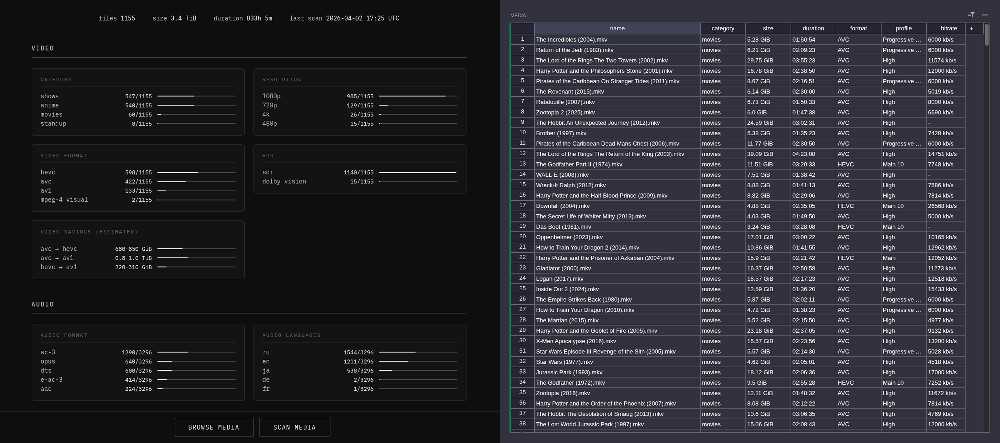

<p align="center">
  
</p>

<p align="center">
  Media file manager for self-hosters. See what's in your library, clean it up, and keep it organized.
</p>

<p align="center">
  <a href="https://alexkouzel.github.io/cinerr/landing/">Website</a>
  &nbsp;•&nbsp;
  <a href="https://alexkouzel.github.io/cinerr/demo/">Try Demo</a>
</p>

<p align="center">
Whether you download manually, rip your own discs, or run the full arr stack, once files land in your library, nobody tells you what's actually inside them. Which files are bloated. Which have audio tracks you never wanted. Which are wasting space.<br><br>
Cinerr fills that gap.
</p>

<p align="center">
  
</p>

## Features

- **Stats dashboard** - instantly see what your library is made of: video formats, resolutions, HDR, audio and subtitle languages, and how much space you could free up by transcoding
- **Media browser** - codec, bitrate, resolution, audio tracks, and subtitles for every file in one place
- **Smart scanning** - powered by `mediainfo`, fast rescans that only reprocess changed files
- **Background jobs** - scanning and file operations run in the background, with pause, resume, and cancel

## Quick Start
```yaml
services:
  cinerr:
    image: alexkouzel/cinerr:latest
    container_name: cinerr
    ports:
      - "8080:8080"
    volumes:
      - /path/to/your/media:/media:ro
      - cinerr_data:/data
    restart: unless-stopped

volumes:
  cinerr_data:
```

1. Replace `/path/to/your/media` with your media directory
2. Run `docker compose up -d`
3. Open `http://localhost:8080`
4. Click **SCAN MEDIA** and see your library come to life

Your media is mounted read-only. Cinerr will never touch your files during scanning.

## Running Locally

**Prerequisites:** Python 3.12+, `mediainfo` installed on your system
```bash
# Clone the repo
git clone https://github.com/alexkouzel/cinerr.git
cd cinerr

# Install dependencies
pip install -r requirements.txt

# Copy and edit the environment file
cp .env.example .env

# Run the server
python backend/server.py
```

Open `http://localhost:8080`.

## License

Cinerr is licensed under the [Apache License 2.0](LICENSE).
